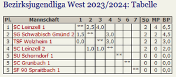

## Auftakt Bezirksjugendliga 

Am Samstag startete die neugeschaffene Bezirksjugendliga West im Schachbezirk Ostalb in die ersten beiden Runden.

In der ersten Begegnung traf Welzheim auf die 2. Mannschaft von Leinzell und konnte erfolgreich mit einem 3:1 Auftaktsieg einen ersten Erfolg erzielen. Marlon Lindauer und Felix Bayha konnten ihre Gegner besiegen, und den Erfolg konnten Björn Lang sowie Jonas Mettler jeweils mit einem Unentschieden komplettieren. 

In der 2. Runde gab es dann allerdings gegen die deutlich stärkere Mannschaft von Leinzell 1 nichts zu holen und man musste alle Partien verloren geben zum Entstand von 4:0 für Leinzell. 

