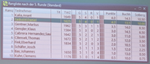
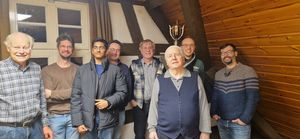

# Schwäbischer Wald Schachtreff in Murrhardt

Da aktuell die Übungsabende sowohl in Murrhardt als auch in Welzheim nur von wenigen Teilnehmern besucht werden, kam der Vorschlag einmal im Monat einen gemeinsamen Übungsabend abzuhalten, um die Spielabende attraktiver zu machen:

  * Nicht immer gegen die gleichen Gegner spielen zu müssen
  * Größere Auswahl an Gegnern

Interessant wird das ganze vor allem, da die Vereine, trotz räumlicher Nähe, zum Teil in unterschiedlichen Schachbezirken spielen.

So spielt Murrhardt im Bezirk Stuttgart, Gaildorf/Fichtenberg in Bezirk Unterland und Alfdorf, Spraitbach und Welzheim im Bezirk Ostalb, d.h. im „normalen“ Spielbetrieb werden sich die Mannschaften aus den unterschiedlichen Bezirken nicht begegnen.

Die erste gemeinsamen Veranstaltung haben die Schachfreunde aus Murrhardt am Freitag, den 27. Januar organisiert.

Insgesamt kamen 10 Schachfreunde zusammen (6 aus Murrhardt und 4 aus Welzheim) für ein Schnellschachturnier. Gespielt wurden 5 Runden Schweizer System mit einer Bedenkzeit von 15 Minuten.

Den Sieg konnte sich der Murrhardter Schachfreund Kalia Anant sichern, mit 4 Siegen aus 5 Partien, hauchdünn dahinter Daniel Seibold aus Welzheim, der ebenfalls 4 Siegen aus 5 Partien erzielte, aber dank der schlechteren Buchholzwertung (Gewinnpartien der Gegenspieler) sich knapp geschlagen geben musste.

Abschlusstabelle:

Von links: Clemens Kuhn, Johannes Bay, Kalia Anant, Markus Gentner, Eberhard Fink, Thomas Cilensek, Daniel Seibold, Saul Cabrera-Hernandez

Als nächste Veranstaltung ist ein Blitzturnier geplant, welches am Freitag, den 3. März in Welzheim stattfinden wird.
