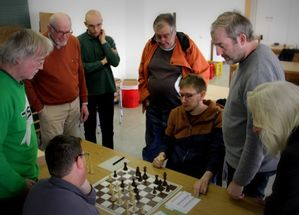
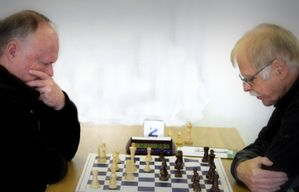

## Erfolge für TSF-Schachmannschaften

In der dritten Verbandsspielrunde der **Bezirksliga** 2022/23 trafen die TSF Welzheim I und der SC Heubach I aufeinander. Da in den vorangegangenen Runden Welzheim bisher zu einem Punkt gekommen und Heubach punktlos geblieben waren, kam der Begegnung bereits die Bedeutung eines „Vier-Punkte-Spiels“ zu, denn der Sieger würde ins Mittelfeld vorrücken, während sich der Verlierer im Kampf um den Klassenerhalt wiederfinden würde.

Für Welzheim verlief der Auftakt denkbar vielversprechend: Heubach konnte keine vollzählige Mannschaft aufbieten, so dass Frederik Göhring und Hans Latzel kampflos zu Punkten kamen und damit Welzheim 2:0 in Führung brachten.

Durch diesen unverhofften Rückenwind begünstigt, hätten die anderen Welzheimer Spieler mit einer gewissen Gelassenheit zu Werke gehen können. Doch im Gegenteil, stattdessen entwickelte sich der Spielverlauf in einigen Partien zu einem derart lebhaften und heftigen Auf-und-Ab, dass sich bei Welzheims Mannschaftsführer Eberhard Fink mehr als einmal Sorgenfalten auf der Stirn abzeichneten.

So büßte Wolfgang Göhringer frühzeitig eine Figur ein; Heiko Bubeck fand sich nach starkem Beginn plötzlich in völlig unwägbaren Turbulenzen wieder. Daniel Seibold verlor, nach Bauerngewinn in der Eröffnung, eine Figur, und Eberhard Fink selbst musste nach einem fehlerhaften Abtausch den Verlust eines Bauern beklagen.

Wären alle vier Partien zugunsten von Heubach entschieden worden, was zeitweise möglich schien und ein 4:4-Unentschieden bedeutet hätte, wäre dies ein herber Rückschlag für Welzheim gewesen. Doch die Schachgöttin hielt die schützende Hand über die TSF-Kämpfer: Zwar unterlagen Fink und Seibold, doch Bubeck wendete ebenso das Blatt wie Göhringer, der mit einem Mattangriff zum Erfolg kam.

Da Michael Wohlfahrt und Emil Schäfer souverän ihre Partien gewannen, - wobei Schäfer um Partieschluss ein seltenes „Familienschach“ gelang, bei dem sein Springer dem gegnerischen König Schach bot und gleichzeitig mehrere andere Figuren bedrohte, hieß es am Ende 6:2 für Welzheim – worüber sich die Spieler fast ebenso verwundert die Augen rieben wie sie sich darüber freuten.

In der zweiten Runde der neu geschaffenen **Beginner-Liga** , deren Mannschaften mit Kindern und Jugendlichen besetzt sind und ihnen so einen Einstieg in die besondere Atmosphäre von Mannschaftswettkämpfen bietet, kamen die TSF Welzheim III, obwohl ein Brett unbesetzt blieb, gegen die SF 90 Spraitbach VI zu einem ersten Teilerfolg. Yan-Christopher Hamm und Jonas Mettler gewannen ihre Partie, während Arseni Baskov leer ausging Endstand: 2:2.
