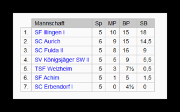

# DSOL 6. Runde Welzheim - SF Illingen 1:3

Nachdem Welzheim in der Runde 5 spielfrei hatte, ging es In der 6. Runde gegen die SF Illingen.

Nach den Begegnungen gegen Mannschaften aus dem norddeutschen Raum, gab es diesmal ein Duell gegen eine Mannschaft aus Württemberg. Illingen liegt im Enzkreis bei Vaihingen/Enz.

Ergebnisse

| [TSF Welzheim](https://dsol.schachbund.de/mannschaft.php?s=2021&l=7c&m=1 "TSF Welzheim")|  1 - 3|  | [SF Illingen I](https://dsol.schachbund.de/mannschaft.php?s=2021&l=7c&m=6 "SF Illingen")|  |   
---|---|---|---|---|---|---  
Brett 1:| 1691| [Heiko Bubeck](https://dsol.schachbund.de/spieler.php?s=2021&l=7c&p=4)|  | 0| :| 1|  | [Thomas Grünert](https://dsol.schachbund.de/spieler.php?s=2021&l=7c&p=40)| 1707  
Brett 2:| 1605| [Brandan Marcel Hegi](https://dsol.schachbund.de/spieler.php?s=2021&l=7c&p=6)|  | 1| :| 0|  | [Torsten Häfele](https://dsol.schachbund.de/spieler.php?s=2021&l=7c&p=41)| 1678  
Brett 3:| 1539| [Wolfgang Göhringer](https://dsol.schachbund.de/spieler.php?s=2021&l=7c&p=7)|  | 0| :| 1|  | [Thomas Clemens](https://dsol.schachbund.de/spieler.php?s=2021&l=7c&p=42)| 1675  
Brett 4:| 1242| [Arno Hupprich](https://dsol.schachbund.de/spieler.php?s=2021&l=7c&p=8)|  | 0| :| 1|  | [Georg Wurdig-Falkenberg](https://dsol.schachbund.de/spieler.php?s=2021&l=7c&p=43)| 1651  
|  |  |  |  |  |  |  |  |  |  |  |   
  
Die Spiele lassen sich nachspielen, wenn man auf die unten aufgeführten Hyperlinks drückt (Brett x)  
---  
  
Heiko an [Brett 1](https://share.chessbase.com/SharedGames/share/?p=FaICWASdwKInsmvMpgphsmAAtWix8+QiyUo8eX8UGyK1ml0uv61RnaiHNitSNUcP) ließ sich nach ausgeglichener Eröffnung zu einem unglücklichen Damenangriff verleiten und wurde dafür mit einem Minusbauern und schlechter Stellung bestraft. Sein Gegner nutzte dies konsequent aus und gewann die Partie.

Brandan an [Brett ](https://share.chessbase.com/SharedGames/share/?p=FaICWASdwKInsmvMpgphskr86QOGJTnTp5OmuEvJetncgHGK+9H2tnFiydgvH5zk)2 kam nach ausgeglichener Eröffnung immer besser ins Spiel. Nach einem Fehler gab Brandans Gegener die Partie auf und es bleibt nach 1:1 spannend.

Arno an [Brett 4 ](https://share.chessbase.com/SharedGames/share/?p=bS6jtU/pponzzonu64W05xgZw8j+KC4njxSZ0W+o+t0tfUZ2wpQvfbwqymR+Bcrh) mit Weiß hatte nicht seinen besten Tag. Nach ausgeglichenem Start, konnte sein Gegner die Stellung Zug um Zug verbessern. Ein unglücklich positionierter Springer am Rand und die fehlende Rochade kostete dann am Ende die Partie und Illingen ging wieder mit 2-1 in Führung.

Es blieb spannend an [Brett 3](https://share.chessbase.com/SharedGames/share/?p=uDaLlREjTH35sMuEeWA+uHb2wS4XJiIciy6vb6xJOQqNzbLluSz+Dv0lyTB9bE52). Nach ausgeglichener Eröffnung konnte Schwarz Druck auf die weiße Königsstellung aufbauen. In schwieriger Stellung hate Wolfgang die Idee eines Bauernvorstoßes, der aber nicht die gewünschte Entlastung brachte und nach einem weiteren Fehler zum Verlust der Partie und damit zum Endstand von 1-3 führte.

Durch diesen Sieg steht Illingen nun unangefochten an der Tabellenspitze.

#### Tabelle nach Runde 6

## 

Das nächste und letzte Spiel ist am Dienstag, den 23. März um 19:30, gegen den Berliner Verein SV Königsjäger SW II.

Zuschauer können die Partien über den folgenden Link mitverfolgen:

[https://play.chessbase.com/de/Play?troom=SV Königsjäger SW II&kibitz](https://play.chessbase.com/de/Play?troom=SV%20Königsjäger%20SW%20II&kibitz)
