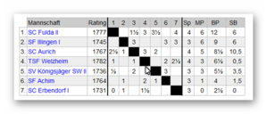

## DSOL 4. Runde Welzheim SF Achim 2:2

In der 4. Runde ging es gegen die Mannschaft des SF Achim.  
Die Stadt Achim liegt im Landkreis Verden, südöstlich von Bremen und hat ca. 30000 Einwohner.  
Die SF Achim konnte 2x in Führung gehen aber in spannenden Partien konnte Welzheim jedes Mal ausgleichen.

Ergebnisse

|  | [TSF Welzheim](https://dsol.schachbund.de/mannschaft.php?s=2021&l=7c&m=1 "TSF Welzheim")|  | 2| −| 2|  | [SF Achim](https://dsol.schachbund.de/mannschaft.php?s=2021&l=7c&m=4 "SF Achim")  
---|---|---|---|---|---|---|---  
Brett 1| DanielSeibold| 1699| [Daniel Seibold](https://dsol.schachbund.de/spieler.php?s=2021&l=7c&p=3)|  | 0| :| 1|  | [Dr. Tim Freudenthal](https://dsol.schachbund.de/spieler.php?s=2021&l=7c&p=18)| 1939| Globetrottel  
Brett 2| Heiko_Welzheim| 1691| [Heiko Bubeck](https://dsol.schachbund.de/spieler.php?s=2021&l=7c&p=4)|  | 1| :| 0|  | [Dr. Matthias Oehm](https://dsol.schachbund.de/spieler.php?s=2021&l=7c&p=19)| 1784| Moehm  
Brett 3| Schachlupus2| 1539| [Wolfgang Göhringer](https://dsol.schachbund.de/spieler.php?s=2021&l=7c&p=7)|  | 1| :| 0|  | [Leonid Bussler](https://dsol.schachbund.de/spieler.php?s=2021&l=7c&p=20)| 1662| Amateur7  
Brett 4| Sari7| 913| [Johanna Kimmerle](https://dsol.schachbund.de/spieler.php?s=2021&l=7c&p=9)|  | 0| :| 1|  | [Hubert Sturm](https://dsol.schachbund.de/spieler.php?s=2021&l=7c&p=21)| 1669| stubert  
  
Die Spiele lassen sich nachspielen (mit Kommentaren von Eberhard) wenn man auf die unten aufgeführten Hyperlinks drückt (Brett x)  
  
Das erste Spiel an [Brett 4](https://share.chessbase.com/SharedGames/share/?p=SdREBAVN+yW6p7VkfySgpwLQg3XlKP8yatKz336A4iFEL1vu7u8NpOJvfAzequ3V) ging schnell verloren. Nach 2 im Königsgambit unüblichen Springerzügen stand Johanna etwas schlechter und übersah ein Läuferopfer auf f7 mit überlegenem Spiel für Weiß

Heiko an [Brett ](https://share.chessbase.com/SharedGames/share/?p=LTfug68l/Qi6oBoT8dDNP2KZk+iNkwSyH5ew7znHP6fdPlLCoIS+y1rVP+RramYi)2 hatte ein ausgeglichenes Spiel. Dank eines Fehlers seines Gegners konnte Heiko eine Mattdrohung aufbauen, die nur unter Materialverlust abzuwenden war und sein Gegner deshalb aufgab.

Daniel an [Brett 1 ](https://share.chessbase.com/SharedGames/share/?p=Itvokl5D6mgrz6MXsSJK/I3K+QN87QGnyzPph/5nomSilzB2q4OFDH9A50MVAD5X) mit Schwarz konnte in der Eröffnung durch einen Fehler seines Gegners eine Leichtfigur für 2 Bauern gewinnen und stand deshalb lange Zeit besser. Doch sein um 250 DWZ-Punkte stärkere Gegner konnte den Druck abwehren und kam immer besser in die Partie zurück und konnte, dank der schwachen schwarzen Grundreihe, mit einem Läufer mehr ins Endspiel kommen, und dieses souverän zum 1-2 verwerten.

Es blieb spannend an [Brett 3](https://share.chessbase.com/SharedGames/share/?p=a9i6EWiJdEyZuRLPrKDsZvOrFkxD+pfvCp3EF31tVy9O1bvsPpCeA0DjbD3j/NS7). Nach ausgeglichener Eröffnung kam Wolfgang mit Weiß im Mittelspiel ins Hintertreffen, da sein Gegner gewältigen Druck auf die weiße Königsstellung aufbauen konnte. Dank Wolfgangs zäher Verteidigung machte Schwarz nicht immer die besten Züge und Wolfgang konnte nach mehrerer Figurenabtauschen dem Druck standhalten und in ein minimal besseres Endspiel überleiten. In Zeitnot tauschte der Gegner die Dame und Wolfgang hatte jetzt mit einem Mehrbauern das bessere Endspiel und konnte zum Endstand von 2-2 ausgleichen.

Tabelle nach Runde 4

## 

Das nächste Spiel ist am Freitag, den 19. März um 19:30, gegen die SF Illingen.

Dann sind mal wieder im süddeutschen Raum, den Illingen liegt bei Vaihingen/Enz.

Zuschauer können die Partien über den folgenden Link mitverfolgen:

[https://play.chessbase.com/de/Play?troom=TSF Welzheim&kibitz](https://play.chessbase.com/de/Play?troom=TSF%20Welzheim&kibitz)
