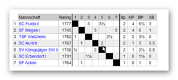

# Welzheim verliert in der 2. Runde mit 1 - 3 gegen den SC Fulda II

In der 2. Runde ging es am Freitag, den 5.2. ging es gegen die 2. Mannschaft des SC Fulda.  
Die Stadt [Fulda](https://de.wikipedia.org/wiki/Fulda) liegt im Osten Hessens westlich der Rhön _._

Ergebnisse

| [TSF Welzheim](https://dsol.schachbund.de/mannschaft.php?s=2021&l=7c&m=1 "TSF Welzheim")|  | 1| −| 3|  | [SC Fulda II](https://dsol.schachbund.de/mannschaft.php?s=2021&l=7c&m=2 "SC Fulda II")  
---|---|---|---|---|---|---|---  
Brett 1| EberhardFink| 1865| [Eberhard Fink](https://dsol.schachbund.de/spieler.php?s=2021&l=7c&p=1)|  | 0| :| 1|  | [Uwe Hasselbacher](https://dsol.schachbund.de/spieler.php?s=2021&l=7c&p=11)| 1830| Allrounder  
Brett 2| Meddle| 1730| [Michael Wohlfahrt](https://dsol.schachbund.de/spieler.php?s=2021&l=7c&p=2)|  | ½| :| ½|  | [Andreas Hartmann](https://dsol.schachbund.de/spieler.php?s=2021&l=7c&p=13)| 1659| Andreas Hartmann  
Brett 3| Heiko_Welzheim| 1691| [Heiko Bubeck](https://dsol.schachbund.de/spieler.php?s=2021&l=7c&p=4)|  | 0| :| 1|  | [Paul Kopco](https://dsol.schachbund.de/spieler.php?s=2021&l=7c&p=14)| 1599| paulkopco  
Brett 4| braheg| 1605| [Brandan Marcel Hegi](https://dsol.schachbund.de/spieler.php?s=2021&l=7c&p=6)|  | ½| :| ½|  | [Milos Maksimovic](https://dsol.schachbund.de/spieler.php?s=2021&l=7c&p=17)| 1554| michgl  
  
Im Spiel an [Brett 4 ](https://share.chessbase.com/SharedGames/share/?p=Ds9iOdb5JWy4zN0GXXFHF/KUwkVyKZx9/SDGroxEMJ6ZLh4sOfNCIOmbdR/cQucO) hat die nachträgliche Analyse am Computer ergeben, dass Brandan das Spiel im 24. Zug mit Sxh3+ (anstatt Dg6) hätte gewinnen können, allerdings ist der Gewinnweg nicht trivial … eine Computer-Engine sieht das, aber es ist zugegebenermaßen nicht so einfach wenn man am Brett sitzt, zumal es für Weiß mehrere Möglichkeiten gibt zu reagieren, und all die daraus resultierenden Varianten durchzurechnen ist für ein menschliches Gehirn nur beschränkt möglich.

Im Mittelspiel erreichte der Spieler aus Fulda ein deutliches Übergewicht, aber da auch er nicht immer die besten Züge fand, endete die Partie mit einem Remis.

Im Spiel an [Brett 1](https://share.chessbase.com/SharedGames/share/?p=M4+drQ9GBHeDsAXrnUQmHzofW1446I+SQ5/MXzhwubBm0SE4nurLw+tP7xE1AIEI) hatte Eberhard im 11. Zug ein Problem mit einer hängenden Computermaus. Anstatt der geplanten Rochade wurde daraus der Zug Kf8, was sofort zu einem Übergewicht für Fulda führte. Um den jetzt eingesperrten Turm zu aktivieren, waren Bauernzüge notwendig, die die Königsstellung schwächten und schließlich zum Verlust der Partie führte.

Spannend war die Partie an [Brett 3](https://share.chessbase.com/SharedGames/share/?p=p90AsvIrdTvZkO5s6Kv4I9eJCNJ3nkb1ebHl9uP3oclV4rGPltFQL0TMAFXpT973). Heiko konnte mit einer unüblichen Eröffnung eine aussichtsreiche Stellung erzielen und Druck auf den schwarzen König ausüben. Durch einige Ungenauigkeiten verlor er aber einen Springer und einen Läufer und damit die Partie.

Damit stand es 0,5 -2,5 für Fulda, und Welzheim hatte die Begegnung damit schon verloren.

Michael an [Brett 2](https://share.chessbase.com/SharedGames/share/?p=VuXSwecSaetrTmHB/hcUEnpZYLbiad7N0I9u4CXx/Lvvr6bjpFkZQO+zwY7KboEL) steuerte in einer ausgeglichenen Partie noch ein Remis zur Ergebnisverbesserung bei. Es gab noch etwas Aufregung, als sein Gegner wegen eines technischen Problems seinen PC neu starten musste, und die Partie von Chessbase als verloren gewertet wurde. Durch den Schiedsrichter wurde die Partie aber nochmals freigegeben und dann auf regulärem Weg beendet.

Tabelle nach Runde 2

## 

Das nächste Spiel ist am Dienstag, den 9. Februar um 19:30, gegen den SC Aurich  
Zuschauer können die Partien über den folgenden Link mitverfolgen:

[https://play.chessbase.com/de/Play?troom=SC Aurich&kibitz](https://play.chessbase.com/de/Play?troom=SC%20Aurich&kibitz)

Für Schachinteressierte gibt es am 12. Freitag wieder die Live-veranstaltung, die von Großmeister Sebastian Siebrecht moderiert wird.  
Der Internetlink ist: <https://www.twitch.tv/schachdeutschlandtv>

Die Videos von Runde 2:  
<https://www.twitch.tv/videos/902155175>  
<https://www.twitch.tv/videos/902114249>
