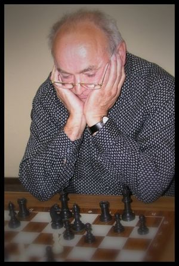
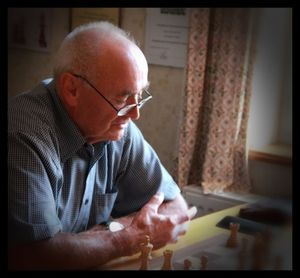
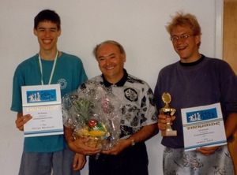

## Trauer um Hans Stiefelreiter

Alles Grübeln darüber, wie und wann im Schach wieder ein geregelter Ablauf möglich sein wird, wurde Mitte Mai von der Nachricht überschattet, dass die TSF-Schachabteilung eines ihrer prägenden Mitglieder verloren hat – Hans Stiefelreiter.

**Nachruf**

Hans Stiefelreiter hat über Jahrzehnte das Vereinsleben der Schachabteilung in verschiedenen Funktionen durch sein Wirken wesentlich mitbestimmt.

Unvergessen seine Arbeit als Jugendleiter, die er mit kurzen Unterbrechungen von 1974 bis 1999 ausübte. Zusätzlich hat sich Hans über 26 Jahre als Spielleiter engagiert. Nicht zu vergessen sein jahrzehntelanger Einsatz als zuverlässiger und unermüdlicher Kämpfer sowohl in der ersten und zweiten Mannschaft als auch bei den Schachsenioren.

**Aus einem (bewegten) Leben für das Schach und mit dem Schach:**

****

****

Jugendleiter Hans Stiefelreiter umgeben von seinen „Musterschülern“ Philipp Marquardt (links) und Dennis Dold (rechts).

Wir haben einen wertvollen Menschen verloren, der sich immer zuverlässig und mit ganzem Herzen für unseren Verein eingesetzt hat. Sein freundliches und hilfsbereites Wesen werden wir in bester Erinnerung behalten. Wir verabschieden uns von ihm mit Dank und Respekt.

Unser tiefes Mitgefühl gilt seiner Familie.
