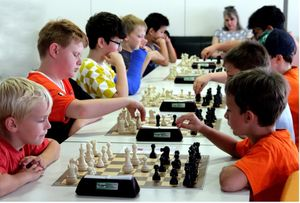
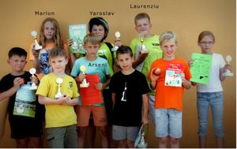
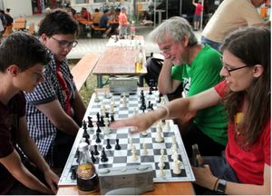
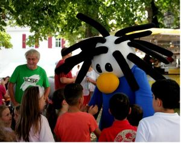
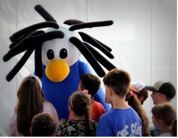
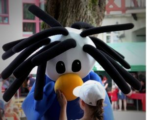
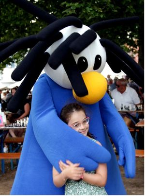

---
tags:
  - Deutsche Schachjugend
  - Turnier in Welzheim
  - WAM
  - WJPT
  - SSGT
---

# Turnier-Wochenende und „Chessy“ beim Stadtfest

Nach den überaus erfolgreichen und von den Teilnehmern gelobten Turnier-Veranstaltungen 2019 und im Jubiläumsjahr 2023 lud die TSF-Schachabteilung zum dritten Mal zu einer Turnierserie ein.

64 Spielerinnen und Spieler folgten dieser Einladung und reisten aus Nah und Fern – sogar aus Aschaffenburg - an, um gemeinsam mit den Welzheimer Lokalmatadoren in drei zeitgleich ablaufenden Turnieren um Pokale, Medaillen und Wertungspunkte zu kämpfen.

Dementsprechend herrschte Hochbetrieb in der Eugen-Hohly-Halle und der Christian-Bauer-Mensa. Das Organisationsteam um Abteilungsleiter _Eberhard Fink_ und _Peter Eggert_ , wie in den Vorjahren tatkräftig unterstützt von _Johannes Bay_ aus Murrhardt, hatte zusammen mit den zahlreichen Helfern aus der Abteilung alle Hände voll zu tun.

Denn zuvor und in den weiteren Stunden gab es für alle vielfältige Aufgaben im Umfeld wahrzunehmen: Auf- und Abbau der Hallen- und Spielausstattung (Bretter, Figuren, Schachuhren, Partieformulare), Anmeldungsformalitäten, die richtige Zuordnung der Teilnehmer zu den Turnieren, bis hin zur Schiedsrichtertätigkeit im Jugendpokal- und Schulschach-Turnier. Zu guter Letzt schließlich waren den Siegerinnen und Siegern der jeweiligen Spielklassen die verdienten Pokale, Medaillen und Trostpreise auszuhändigen. – Nicht zu vergessen am Ende des Tages: der Abbau sämtlicher Turnier-Einrichtungen.

Jungen Schach-Einsteigern und Turnier-Neulingen bot das _Schulschach-Grandprix-Turnier (SSGT)_ reichlich Gelegenheit, gegen gleichaltrige Kontrahenten anzutreten, erste Erfahrungen zu sammeln und Wettkampfluft zu schnuppern.

Kinder und Jugendliche, die bereits über einige Turniererfahrung verfügen, konnten im _Württembergischen Jugend-Pokalturnier (WJPT)_ ihre Kräfte miteinander messen. Hier überzeugten gleich vier Welzheimer Lokalmatadoren: _Arseni Baskov, Marlon Lindauer, Yaroslav Samoilov_ und _Laurenziu Eggert_ durften jeweils einen Pokal mit Hause nehmen.

Auch der _Württembergischen Amateurmeisterschaft (WAM)_ liegt die Idee zugrunde, dass es der Spielfreude aller Beteiligten nur zuträglich sein kann, wenn Spieler mit einer jeweils vergleichbar hohen Wertungszahl in einer Gruppe aufeinandertreffen. Dementsprechend tragen bei der WAM vier Spieler ein Rundenturnier (drei Partien) nach dem Modus „jeder gegen jeden“ aus.

Wie im Vorjahr wurde hier in manchen Gruppen besonders ausgiebig und hartnäckig gekämpft. Erst um 19 Uhr war die Entscheidung in der letzten Spielgruppe gefallen.

Mit dabei in einer der 10 Gruppen: TSF-Kämpfer _Erhard Kuhn_. Ihm gelangen zunächst zwei Siege, bevor er in der 3. Runde unterlag. Da er und sein Kontrahent danach punktgleich an der Spitze standen, mussten Blitzpartien (5 Minuten Bedenkzeit pro Partie für jeden Spieler) über den Pokalgewinner entscheiden. Hier unterlag Kuhn, durfte sich aber dennoch über Platz 2 und eine Medaille freuen.

**Schachmobil beim Stadtfest**

Wie bereits im Vorjahr war die TSF-Schachabteilung auch beim Welzheimer Stadtfest mit einem Stand vertreten. Da die Turniere und das Stadtfest diesmal an einem Wochenende zu bewältigen waren, sah sich die vergleichsweise kleine Schachabteilung vor weiteren organisatorischen Herausforderungen beim Auf- und Abbau der für einen reibungslosen Ablauf nötigen Utensilien gestellt. Dank der engagierten Einsatzfreude der Mitglieder ging alles glatt über die Bühne.

Die 15 Tisch- und zwei Freiland-Schachbretter , die samt Figuren unter den Bäumen auf dem Kirchplatz bereitgestellt waren, fanden bei den Besucherinnen und Besuchern, bei jungen und älteren Schachinteressierten nach dem Besuch des Gottesdienstes, des Flohmarktes oder nach dem Genuss der vielseitigen kulinarischen Angebote vielfaches Interesse.

Wie im Vorjahr reiste auch diesmal die _Deutsche Schachjugend_ mit ihrem Schachmobil an.

TSF-Schach-Abteilungsleiter Eberhard Fink (hintere Reihe rechts) in einem freundschaftlichen Duell mit den drei Schachmobilisten Bastian, Adrian und Tobias.

Erfreulich viele Kinder und Jugendliche nutzten die Gelegenheit zu einer Partie gegeneinander. Oder sie forderten mutig die anwesenden TSF-Schachspieler heraus. Wieder andere ließen sich von den Schachmobilisten und Welzheimer Vereinsmitgliedern geduldig die Grundregeln des königlichen Spiels erklären.

Weit über das von den Organisatoren zunächst für 18 Uhr anvisierte Ende der Veranstaltung hinaus ließen sich unermüdliche Flaneure bis in einsetzende Dämmerung hinein zu einem entspannten Spiel animieren.

Einmal mehr _die Attraktion_ am Schachstand war _Chessy_ , das Maskottchen der Deutschen Schachjugend. Da am Sonntag eher angenehme statt heiße sommerliche Temperaturen herrschten, stand seinem Erscheinen, diesem temperaturempfindlichen Wesen, nichts entgegen.

Schnell war Chessy von Kindern umlagert, die umgehend Kontakt suchten, ihm über die große gelbe Clownsnase streichelten oder sich in die großen blauen Arme schließen ließen.

