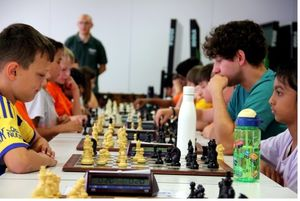
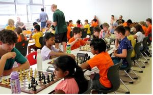
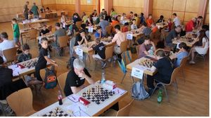

# Rekordbeteiligung an Turnierserie

Bereits zum vierten Mal, nach den Veranstaltungen 2019, 2023 und 2024, lud die Schachabteilung der TSF Welzheim zu einer Turnierserie ein. – Und 105 Spielerinnen und Spieler, so viele wie bisher nie zuvor – folgten der Einladung, um gemeinsam mit den Welzheimer Lokalmatadoren in drei zeitgleich ablaufenden Turnieren um Pokale, Medaillen und Wertungspunkte zu kämpfen.

Bevor es soweit war, gab es bereits vor dem Turniertag viel zu tun: Auf- und Abbau der Hallen- und Spielausstattung (Bretter, Figuren, Schachuhren, Partieformulare). Am Turniertag selbst: Anmeldungsformalitäten, Zuordnung der Teilnehmer zu den Turnieren, bis hin zur Schiedsrichtertätigkeit im Jugendpokal- und Schulschach-Turnier. Schließlich waren die Siegerinnen und Sieger der jeweiligen Spielklassen zu ehren und ihnen die erkämpften Pokale, Medaillen und Trostpreise auszuhändigen. – Nicht zu vergessen am Ende des Tages: der Abbau sämtlicher Turnier-Einrichtungen.

Bis dahin ging es hoch her in der Eugen-Hohly-Halle und der Christian-Bauer-Mensa. Das Organisationsteam um Abteilungsleiter _Eberhard Fink_ und _Peter Eggert_ hatte zusammen mit den zahlreichen Helfern aus der Abteilung alle Hände voll zu tun. Wie in den Vorjahren wurden sie unterstützt durch den Referenten für Breitenschach im Schachverband Württemberg und Cheftrainer im Talentstützpunkt Stuttgart, _Konrad Müller,_ und durch _Johannes Bay_ , der als Turnierleiter für den nötigen Überblick sorgte und über seinen Heimatverein SC Murrhardt zahlreiche Spielutensilien zur Verfügung stellte, ohne die eine Turnierveranstaltung in dieser Größenordnung für die TSF Welzheim alleine nicht zu stemmen gewesen wäre.

Im _Schulschach-Grandprix-Turnier (SSGT)_ kämpften junge Schach-Einsteiger und Turnier-Neulinge gegen gleichaltrige Kontrahenten, um dabei erste Erfahrungen zu sammeln und Wettkampfluft zu schnuppern.

Ungeschlagen und unangefochten an der Spitze mit 7:0 Punkten standen dabei in der Klasse 1-2 Adhira Pawar (SC Bernhausen) und in der Klasse 3 aufwärts Julian Gehring (SpVgg Rommelshausen). Für Welzheim gingen hier Laura Kleeh, Niklas Esswein, Samuel Wolf und David Bulling ins Rennen; alle konnten sich im Mittelfeld platzieren.

Für Kinder und Jugendliche, die bereits über einige Turniererfahrung verfügen, bot das _Württembergischen Jugend-Pokalturnier (WJPT)_ vielfältige Gelegenheiten __ihre Kräfte miteinander messen. Nach fünf Runden lagen hier Tobias Kaltenbach (Schachkids Bernhausen), Joshua Müller (SC Murrhardt) und Felix Wüstenberg (SpVgg Rommelshausen) so dicht beieinander, dass eine Feinwertung (Berücksichtigung der Spielstärke der jeweiligen Gegner) über die Reihenfolge entscheiden musste. Danach behielt Tobias die Nase vorn.

Bei der _Württembergischen Amateurmeisterschaft (WAM)_ trafen vier Spieler mit einer jeweils vergleichbar hohen Wertungszahl in einer Gruppe aufeinandertreffen und trugen ein Rundenturnier (drei Partien) nach dem Modus „jeder gegen jeden“ aus. Wie in den Vorjahren wurde hier in manchen Gruppen besonders ausgiebig und hartnäckig gekämpft. Selbst ein kräftiger Gewitterschauer hinderte die Kontrahenten nicht in ihrem Eifer. Erst kurz vor 8 Uhr abends entschied ein dramatisches „Zeitnotduell“ über den Ausgang in der letzten Spielgruppe.  
  

In einer der vierzehn Vierergruppen gelang Erhard Kuhn in den TSF-Farben ein eindrucksvoller Erfolg. Mit zwei Siegen ging Kuhn in die letzte Runde, wehrte dort alle Gewinnversuche seines direkten Konkurrenten erfolgreich ab, akzeptierte schließlich dessen Remisangebot und wurde damit ungeschlagen Gruppensieger.

Ein Einstand nach Maß gelang TSF-Nachwuchstalent Yaroslav Samoilov. Im Vorjahr kämpfte er in Welzheim erfolgreich im Jugendpokalturnier, jetzt wagte er den Sprung ins WAM-Turnier. Dort musste er sich lediglich dem späteren Sieger geschlagen geben und belegte in seiner Gruppe Platz 2.

Zum Abschluss des Turniertages gab es aus dem Teilnehmerkreis viele lobende Worte für die Organisatoren zu hören. So wurde besonders hervorgehoben, dass vor Turnierbeginn Parkplatzanweiser für den problemlosen Zugang zu den Stellplätzen sorgten – ein Service, wie er bei vergleichbaren Veranstaltungen offenbar nicht geboten wird. Insgesamt also Ansporn genug für eine Neuauflage im nächsten Jahr. Die Planungen dafür laufen bereits an.

Turnierergebnisse im Detail:  
[WJPT + SSGT Welzheim 19.07.2025](https://www.svw.info/menue/schachjugend/wuerttembergischen-turnierserien/jugend-pokalturniere/927-wjpt-2024-25/18303-ergebnisse-des-wjpts-und-der-ssgts-am-19-07-2025-bei-der-schach-abt-des-tsf-welzheim?showall=1)  
[WAM Welzheim 19.07.2025](https://www.svw.info/menue/schachjugend/wuerttembergischen-turnierserien/amateurmeisterschaft/928-wam-2024-25/18304-ergebnisse-der-wam-am-19-07-2025-bei-der-schach-abt-des-tsf-welzheim)
