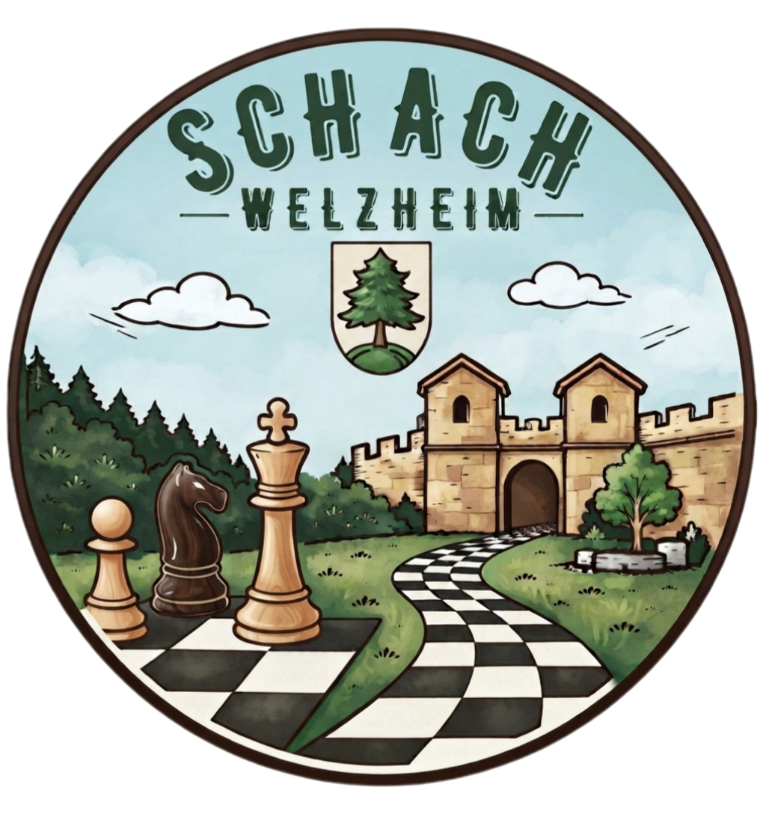

<H1>Willkommen bei Schach in Welzheim</H1>

Hier erfährst du alles rund um Schachaktivitäten in Welzheim. Vor allem wann und wo Du Schach spielen kannst.

    

        <strong>Mach mit!</strong> Bei der [Stadtmeisterschaft](./aktuelles/2026-10-07/) oder beim [Familien-und Freundeturnier](./aktuelles/2026-09-29).
    

    

    
* Schau im Bereich **[Aktuelles](./aktuelles)** vorbei für die neuesten Ereignisse.
* Informiere dich über Aktivitäten für **[Kinder und Jugendliche](./jugend)** und über die Arbeit unseres **[Schachvereins](./verein)**.

Wir freuen uns über alle Schachbegeisterten, die mit uns am Brett zusammenkommen möchten.

Kommt vorbei in den **[Schach AGs](./jugend/schach-ags)**, ins **[Jugendtraining](./verein/jugend)** oder zum **[Schach für alle](./verein/alle)**.

Wir freuen uns auf Euch 💚

---

